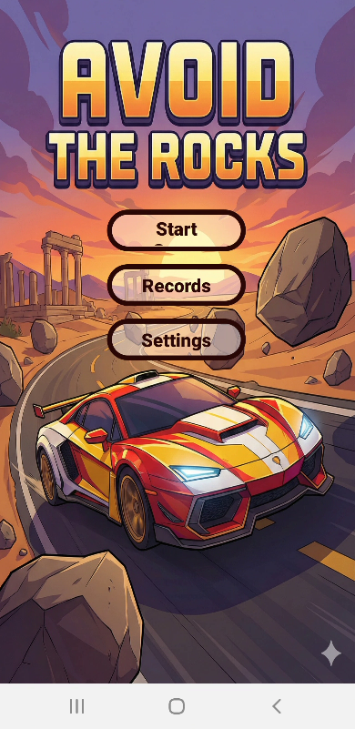
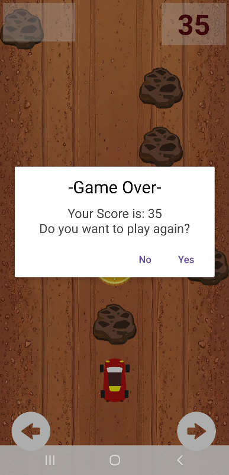
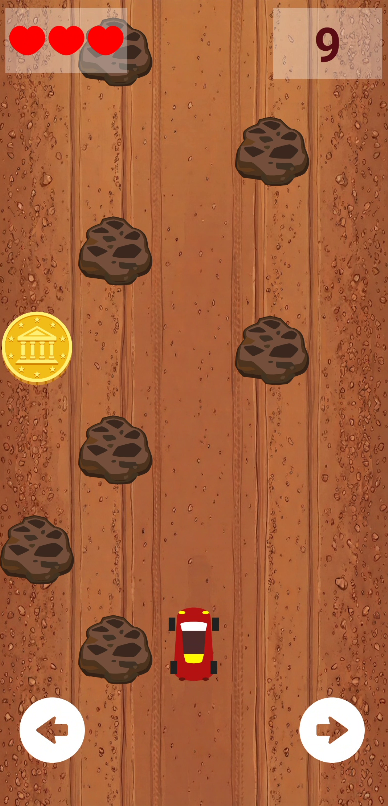
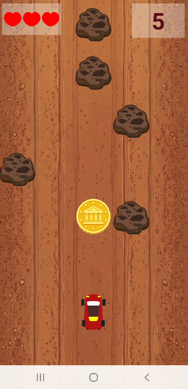
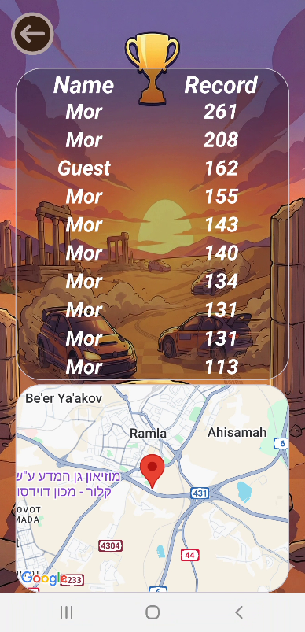
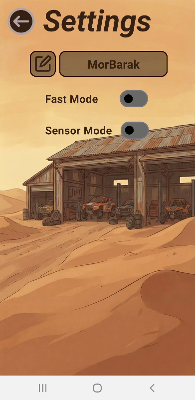

# 🏁 Android Game - Car Survival Racing Challenge 🏎️

A classic Android survival racing game written in Kotlin.
The goal is simple: dodge obstacles, survive as long as possible, maximize your score and break records !

This project integrates various elements as:
* motion sensors
* Google Maps SDK
* complex data persistence
* sound management

**All while focusing on a smooth, simple and enjoyable user experience.**

---

## 🎮 Game Objective
The player controls a vehicle driving in the desert that filled with obstacles (rocks and coins).

The objective is to dodge these obstacles by switching lanes and accumulating the highest possible score without crashing.
In addition, the user can improve his score during the game by collect coins that give his 8 more points per coin.

---

## 🗝️ Key Features

### 🕹️ Control Modes
The game offers two distinct control modes, selectable via the settings:
* **Manual Mode (Buttons):** Control the vehicle using on-screen arrow buttons (Left/Right).
* **Sensor Mode:** Control the vehicle using the device's Accelerometer.  
Tilting the phone right or left moves the vehicle accordingly (includes a stabilization mechanism to prevent jitter).

### 🏆 Difficulty Modes
* **Normal Mode:** A slower pace suitable for beginners.
* **Fast Mode:** The vehicle and obstacles move at an increased speed for a real challenge.

### 🥇 Location-Based Leaderboard (LBS)
The game tracks not only the score but also the geographical location where the record was achieved !
* **Top 10 High Scores:** Persists the top 10 results using `SharedPreferences` and `GSON` to manage the data.
* **Google Maps Integration:** The records screen features an embedded interactive map.
* **Smart Zoom:** Clicking on a specific row in the high scores table (Player Name or Score) instantly zooms the map camera to the exact location where that specific record was set.

### 🔊 User Experience (UX) & Audio
* **Background Music:** looped music track accompanying the game while in the lobby.
* **Sound Effects (SFX):** Realistic crash sound effects upon collision & start and game over sounds.
* **Animations:** Smooth transitions between activities and smooth vehicle movements.
* **Toast Messages:** Visual feedback for the user when the game end's.

---

## 📱 App Activities

The application consists of several connected activities:

1.  **Menu Activity:** The main hub allowing navigation to the game, the high scores screen or the settings.
2.  **Game Activity(called Main Activity):** The core game screen. Handles vehicle movement logic, collision detection, timers, and score calculation.
3.  **Records Activity:** Displays the Top 10 Scores List alongside the Google Map (SupportMapFragment).
4.  **Settings Activity:** Where the user can change the User Name, and control the Fast Mode & the Sensors Mode.

---

## 🛠️ Tech Stack & Tools

* **Language:** Kotlin
* **UI:** XML Layouts, Material Design, ViewBinding, SVG Icons
* **Sensors:** Android SensorManager (Accelerometer)
* **Location:** Google Maps SDK, Fused Location Provider
* **Storage:** SharedPreferences (Persistent Data) with JSON parsing (GSON)
* **Audio:** Android MediaPlayer

---

## 📸 Screenshots

  
  

    
       

    
       

---

### 👨‍💻 Developed by
**Mor Barak**